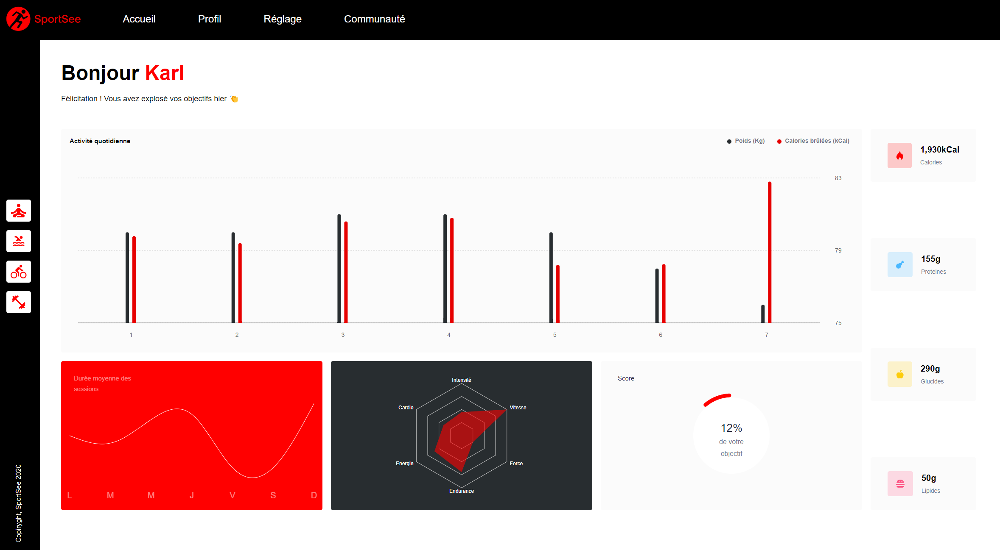

# Formation Développeur d'application - JavaScript React

## 📎 Projet 12 : Sportsee



## Technologies :

- React
- Sass
- Recharts


## Tester le projet :

```terminal
git clone https://github.com/Cyril-Develop/SportSee.git
```
